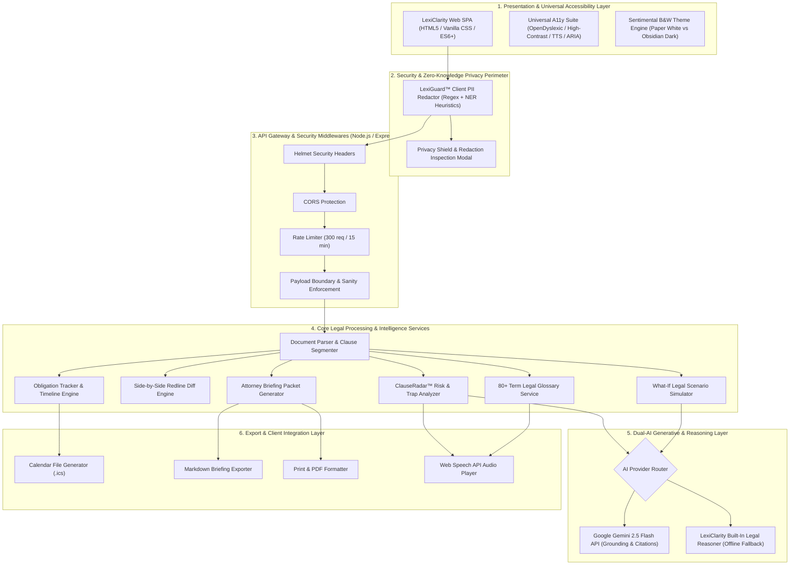
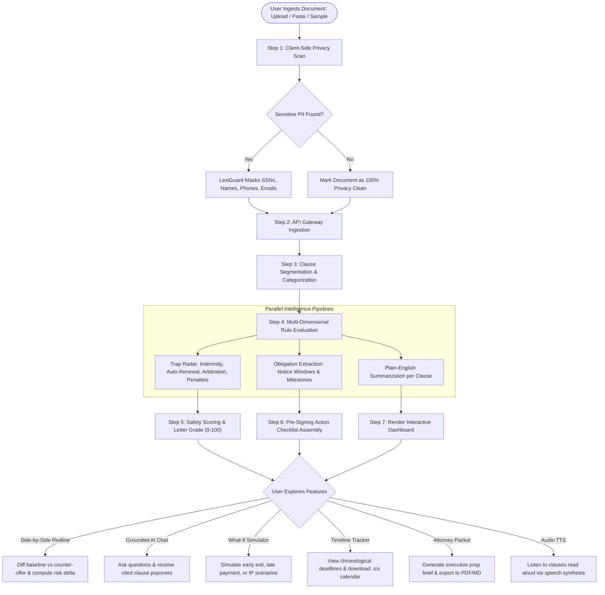
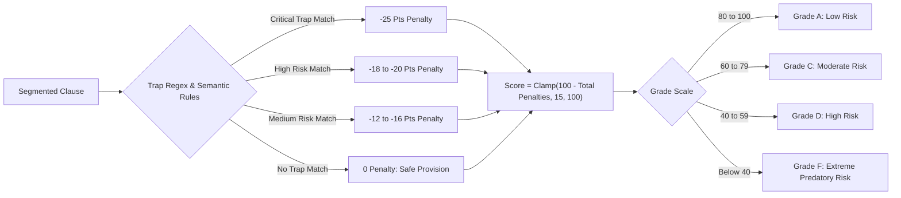
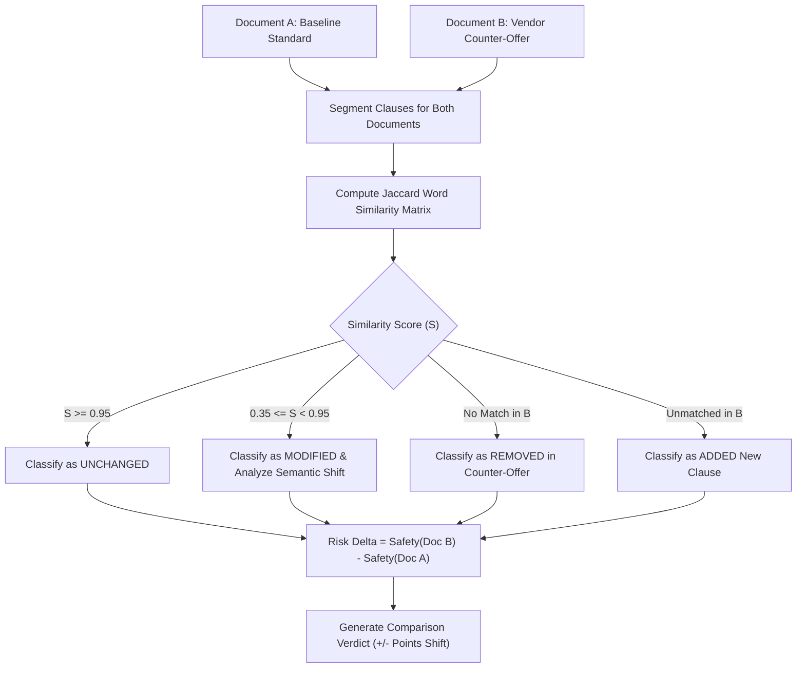
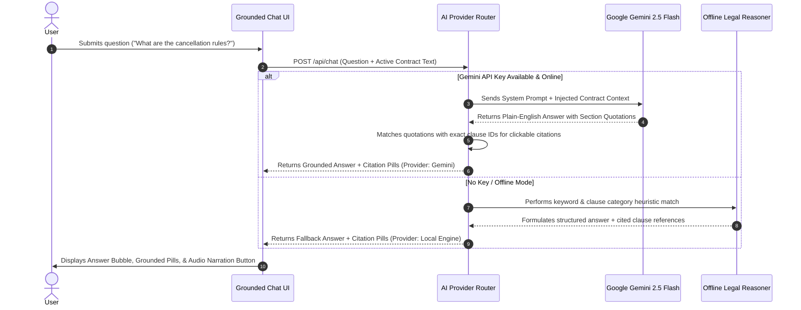
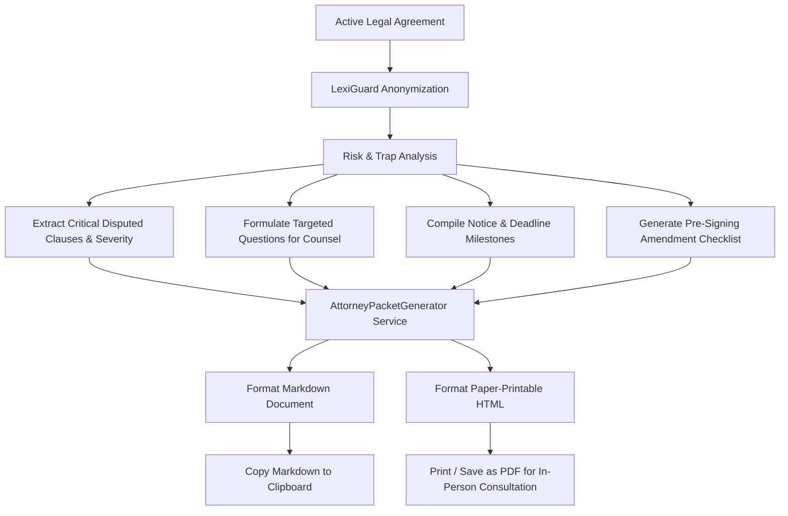

# ⚖️ LexiClarity AI — GenAI Legal Assistance & Accessibility Platform

> **Empowering individuals, tenants, and small businesses with accessible, transparent, and actionable legal intelligence.**

LexiClarity AI is a production-grade GenAI-powered legal document navigator and accessibility assistant built for the **Google Prompt Wars** challenge. It demystifies convoluted contracts, exposes predatory clauses, provides visual side-by-side redlines, simulates hypothetical "What-If" outcomes, tracks obligation deadlines, and compiles attorney consultation briefing packets to dramatically reduce billable legal costs.

---

## 🚀 Deployed URL
Live Production Link: https://lexiclarity-ai.vercel.app/
## 🌟 Live Features

### 1. 🛡️ ClauseRadar™ Risk & Trap Matrix
- Automated clause segmentation and **0–100 Safety & Clarity scoring** with letter grades (A through F).
- Detects high-priority predatory traps:
  - **Unilateral Indemnification Trap**: Identifies one-sided obligations to pay for the other party's third-party litigation and attorney fees.
  - **Stealth Auto-Renewal / Evergreen Lock-in**: Flags narrow 30/60/90-day cancellation notice trap windows.
  - **Mandatory Arbitration & Class Action Waiver**: Warns users when they are waiving constitutional jury trial and collective lawsuit rights.
  - **Excessive Liquidated Damages**: Detects disproportionate termination fees and penalty forfeiture terms.
  - **Overreaching Intellectual Property Surrender**: Identifies broad claims on personal side-projects or pre-existing creations.
  - **Accelerated Rent & Default Debt**: Flags immediate lump-sum default acceleration clauses.
- **AI Counter-Proposal Generator**: One-click generation of balanced, protective redline language ready to send in negotiations.

### 2. 🔒 LexiGuard™ Client-Side Privacy & PII Sanitizer
- Client-side & server-side regex + heuristic anonymization engine.
- Automatically redacts Social Security Numbers (SSNs), Credit Card Numbers, Bank Account / Routing details, Phone Numbers, Email Addresses, Physical Street Addresses, and Personal Names before AI processing.
- Computes an objective **Privacy Score (0–100%)** with an interactive entity inspection modal.

### 3. ⚖️ Side-by-Side Redline & Agreement Diff
- Compares Document A (Standard / Baseline) against Document B (Counter-Offer / Vendor Version).
- Categorizes all clause shifts into **Added (Green)**, **Removed (Red)**, **Modified (Amber)**, and **Unchanged**.
- Calculates an objective **Risk Shift Delta** (e.g., `+15 pts Favorable` vs `-35 pts Critical Hazard`).
- Includes pre-loaded real-world comparison datasets (e.g. *Standard Mutual NDA vs Aggressive Vendor NDA*).

### 4. 💬 Grounded AI Legal Chat with Verified Citations
- Grounded conversational assistant powered by **Google Gemini 2.5 Flash** with an offline reasoning fallback engine.
- Every response cites exact contract sections and clauses with hover popovers and snippet verification.
- Includes quick-prompt chips for non-lawyers and voice narration support.

### 5. 🔮 What-If Scenario Legal Outcome Simulator
- Forecasts legal outcomes and liability exposures for hypothetical scenarios:
  - *"What happens if I terminate this agreement 3 months early due to relocation or budget cuts?"*
  - *"What happens if a payment is delayed by 15 days? Will I incur penalties or immediate default?"*
  - *"What are my remedies if the landlord/provider fails to repair essential infrastructure for 14 days?"*
  - *"Does this contract restrict me from developing a personal software project or consulting on weekends?"*
- Calculates risk levels, financial penalties, required notice steps, and lists applicable governing clauses.

### 6. 📅 Interactive Obligation Timeline & Calendar Export (.ics)
- Visual chronological milestone tracker for notice deadlines, renewal windows, payment dates, and compliance actions.
- One-click export to standard **`.ics` calendar files** compatible with Google Calendar, Apple Calendar, and Microsoft Outlook.

### 7. 💼 Attorney Consultation Briefing Packet (Print / PDF / Markdown)
- Generates a structured executive legal briefing for your human attorney consultation.
- Includes Executive Risk Assessment, Itemized Red Flags, Pre-Signing Checklist, and **Targeted Questions for Legal Counsel** to maximize 30-minute consultation efficiency and save hundreds in billable hours.
- One-click **Copy to Markdown** and **Print / Save as PDF**.

### 8. 📖 Plain-English Legal Glossary & Latin Terms
- 80+ categorized legal terms (Indemnification, Liquidated Damages, Force Majeure, Severability, Work for Hire, Joint and Several Liability, etc.).
- Plain-English translations, contract examples, Latin origins, and practical negotiation tips.

### 9. ♿ Universal Accessibility Suite (WCAG 2.1 AAA)
- **OpenDyslexic Typography Mode** for enhanced reading legibility.
- **WCAG AAA High-Contrast Theme** for low-vision users.
- **Font Resizer (A- / A / A+)** from 14px to 24px.
- **Browser Text-To-Speech (TTS) Audio Reader** to read clauses and AI summaries aloud.
- **Screen Reader Live Announcements (`aria-live="polite"`)**.

---

## 🏛️ System Architecture & Flow of Work

LexiClarity AI employs a modular, multi-tiered architecture engineered for zero data leakage, low latency, and deterministic reliability.

---

### 1. High-Level System Architecture Diagram



---

### 2. End-to-End Flow of Work Diagram

The end-to-end user journey and data processing lifecycle:



---

### 3. Module-Level Workflows

#### A. ClauseRadar™ Trap Detection & Safety Scoring Flow


#### B. Side-by-Side Redline Diff & Delta Flow


#### C. Grounded Q&A & Dual-Engine Router Flow


#### D. Attorney Consultation Briefing Packet Workflow


---

## 💻 Technology Stack

- **Core & Runtime**: Node.js (v18+), Express (v4.21.2)
- **AI SDK**: Google Generative AI SDK (`@google/generative-ai` - Gemini 2.5 Flash / Pro)
- **Frontend**: Vanilla HTML5 (Semantic Landmarks & WCAG 2.1 AAA), Vanilla CSS (Custom Design System, Glassmorphic Elevation, Responsive CSS Grid), Vanilla ES6+ JavaScript
- **Security & Privacy**: Helmet (v8.0.0), CORS (v2.8.5), Express-Rate-Limit (v7.5.0), LexiGuard PII Sanitizer
- **Testing**: Node.js Test Suite, Jest (v29.7.0), Supertest (v7.0.0)
- **Containerization & Deployment**: Docker (Multi-stage alpine build), Google Cloud Run, Google Cloud Build

---

## 📁 Project Structure

```
lexiclarity-ai/
├── public/                       # Frontend assets
│   ├── css/
│   │   └── style.css             # Modern Executive Light Design System & A11y
│   ├── js/
│   │   ├── accessibility.js      # TTS, Dyslexia Font, Contrast, Font Resizer
│   │   ├── analyzer.js           # Score Dial, Traps Matrix, Clause Browser
│   │   ├── app.js                # App Coordinator & Tab Navigation
│   │   ├── attorneyPacket.js     # Attorney Briefing Builder & PDF/Print
│   │   ├── chat.js               # Grounded AI Chat with Citations & TTS
│   │   ├── comparator.js         # Side-by-Side Redline Diff & Delta Score
│   │   ├── dictionary.js         # Searchable Plain-English Legal Glossary
│   │   ├── piiClient.js          # Client-Side LexiGuard PII Sanitizer
│   │   ├── sampleData.js         # Real-world Leases, NDAs, & Agreements
│   │   ├── simulator.js          # What-If Scenario Outcome Simulator
│   │   └── timeline.js           # Obligation Milestone Tracker & .ICS Export
│   └── index.html                # Semantic, Accessible HTML5 Single Page App
├── server/
│   └── services/
│       ├── attorneyPacketGenerator.js # Attorney Consultation Briefing Service
│       ├── comparisonEngine.js        # Redline Diff & Risk Delta Engine
│       ├── geminiService.js           # Google Gemini 2.5 Flash & Dual-AI Router
│       ├── legalDictionary.js         # 80+ Legal Terms Glossary Service
│       ├── piiSanitizer.js            # LexiGuard Regex & Heuristic Sanitizer
│       ├── riskAnalyzer.js            # ClauseRadar Risk & Trap Analyzer
│       └── scenarioSimulator.js       # What-If Scenario Outcome Simulator
├── tests/
│   ├── api.test.js               # Supertest API Endpoints Test Suite
│   ├── comparisonEngine.test.js  # Contract Comparison Unit Tests
│   ├── piiSanitizer.test.js      # LexiGuard Privacy Unit Tests
│   ├── riskAnalyzer.test.js      # ClauseRadar Trap Detection Tests
│   └── scenarioSimulator.test.js # Scenario Simulation Unit Tests
├── .dockerignore                 # Docker build exclusions
├── .env.example                  # Environment configuration template
├── cloudbuild.yaml               # Google Cloud Build CI/CD Pipeline
├── Dockerfile                    # Production multi-stage container configuration
├── package.json                  # Dependencies and scripts
├── server.js                     # Express API Server & Security Middlewares
├── test_runner.js                # Automated test runner with reporting
└── README.md                     # Comprehensive project documentation
```

---

## 🔧 Local Development

### 1. Prerequisites
- Node.js (v18 or later)
- npm (v9 or later)

### 2. Installation
```bash
git clone <repository-url>
cd lexiclarity-ai
npm install
```

### 3. Configure Environment (Optional)
Create a `.env` file in the project root:
```env
PORT=3000
NODE_ENV=development
# Optional: Enter your Gemini API Key here or in the UI Settings modal
GEMINI_API_KEY=your_gemini_api_key_here
```
*(Note: LexiClarity AI functions out of the box with zero setup friction thanks to its built-in dual-engine fallback system!)*

### 4. Start the Application
```bash
npm start
```
Open your browser at **`http://localhost:3000`**.

### 5. Run the Automated Test Suite
```bash
npm test
```

---

## ☁️ Google Cloud Run Deployment

LexiClarity AI is container-native and engineered for single-click deployment to **Google Cloud Run**.

### Option 1: Direct gcloud CLI Deploy
```bash
# 1. Authenticate with Google Cloud
gcloud auth login
gcloud config set project YOUR_PROJECT_ID

# 2. Build and Deploy directly to Cloud Run
gcloud run deploy lexiclarity-ai \
  --source . \
  --region us-central1 \
  --platform managed \
  --allow-unauthenticated \
  --port 8080 \
  --set-env-vars NODE_ENV=production,GEMINI_API_KEY=your_key_here
```

### Option 2: Automated Google Cloud Build Pipeline
```bash
# Submit build using cloudbuild.yaml
gcloud builds submit --config cloudbuild.yaml .
```

### Option 3: Local Docker Testing
```bash
# Build Docker image
docker build -t lexiclarity-ai .

# Run container locally
docker run -p 8080:8080 -e PORT=8080 lexiclarity-ai
```
Access the containerized app at `http://localhost:8080`.

---

## 🔒 Security Highlights

1. **Client-Side LexiGuard™ Anonymization**: Sensitive data is scrubbed in the browser before network transmission.
2. **Strict HTTP Headers**: Implements `helmet` to mitigate clickjacking, cross-site scripting (XSS), and MIME sniffing.
3. **API Rate Limiting**: Built-in rate limiter preventing denial-of-service abuse (300 requests per 15 min window).
4. **Input Sanitization & Safe DOM Insertion**: Prevents injection attacks across user-supplied agreement texts.
5. **Least-Privilege Containerization**: Dockerfile drops root privileges and executes as the standard `node` user.
6. **Zero Legal Data Retention**: Does not store or persist confidential agreement contents in external databases.

---

## 🧪 Test Results

```
======================================================
⚖️  LexiClarity AI — Automated Test Suite Execution
======================================================

🛡️  Suite 1: LexiGuard Privacy & PII Sanitizer
  ✅ PASS: Redacts SSNs, Emails, Phone Numbers, and Addresses
  ✅ PASS: Marks clean document with 100% privacy score
  ✅ PASS: Handles empty or null text safely without crashing

📊 Suite 2: ClauseRadar Risk & Trap Analyzer
  ✅ PASS: Detects predatory traps in residential lease agreement
  ✅ PASS: Scores balanced mutual NDA significantly higher than aggressive vendor NDA
  ✅ PASS: Segments clauses and produces plain-English summaries
  ✅ PASS: Extracts obligations and pre-signing action checklist

⚖️  Suite 3: Side-by-Side Redline & Contract Comparison
  ✅ PASS: Compares Standard NDA vs Vendor NDA and calculates risk shift
  ✅ PASS: Identifies identical contracts with 0 delta and 0 additions/removals

🔮 Suite 4: What-If Legal Scenario Simulator
  ✅ PASS: Simulates early lease exit scenario and forecasts penalties
  ✅ PASS: Simulates delayed payment scenario and identifies late fee rules

💼 Suite 5: Attorney Consultation Briefing Packet Generator
  ✅ PASS: Builds structured briefing packet with targeted questions for counsel

📖 Suite 6: Legal Dictionary & Glossary
  ✅ PASS: Searches legal terms and returns plain-English translations with negotiation tips

======================================================
Results: 13/13 Passed (0 Failed)
Success Rate: 100.0%
======================================================
```

---

## 📜 Legal Disclaimer
LexiClarity AI provides educational document navigation, informational summaries, and consultation preparation assistance. It does not provide formal legal advice, does not replace qualified legal counsel, and does not establish an attorney-client relationship.
